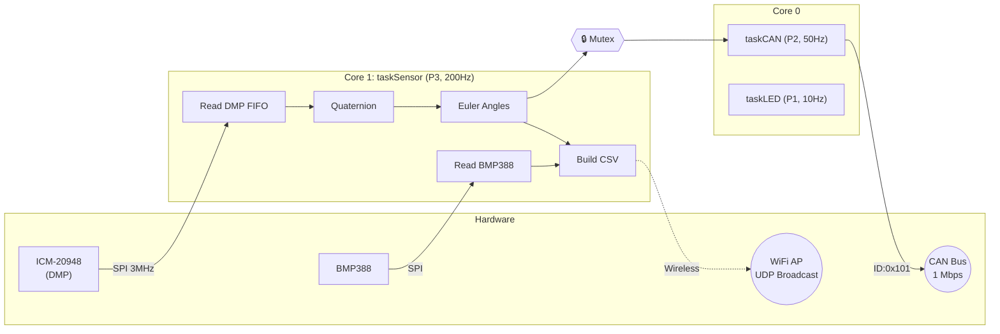

# 🚁 Industrial AHRS Navigation Module (V5.4)


> **High-Precision Navigation Core for Competition Robotics (Robocon)**

The **Industrial AHRS Navigation Module** is a robust sensor fusion engine built on the **ESP32-S3**. It delivers stable 6-axis orientation (Yaw, Pitch, Roll) via **1 Mbps CAN Bus** and offers **Dual-Mode Telemetry** (USB Serial + Wireless UDP) for real-time monitoring.


---

## 📑 Table of Contents

- [Key Features](#-key-features)
- [System Architecture Overview](#-system-architecture-overview)
- [Sensor Fusion Pipeline](#-sensor-fusion-pipeline)
- [System Status Indicators](#-system-status-indicators)
- [Hardware Specifications](#️-hardware-specifications)
- [Quick Start](#-quick-start)
- [Documentation](#-documentation)
- [Project Structure](#-project-structure)

---

## 🚀 Key Features

| Feature | Detail |
| :--- | :--- |
| **DMP Sensor Fusion** | 6-axis fusion offloaded to ICM-20948 DMP using `GAME_ROTATION_VECTOR` at **225Hz** |
| **Wireless UDP** | Low-latency (~20ms) data streaming over WiFi (Broadcast to `192.168.4.255:4210`) |
| **Dual-Mode Dashboard** | Connect via USB (Web Serial) or Wireless (UDP Relay) for real-time visualization |
| **Power Optimized** | Efficient UDP broadcast, WiFi power save enabled, and smart task scheduling |
| **High-Speed CAN** | ESP32-S3 TWAI driver at **1 Mbps** for Robomaster C620/C610 speed controllers |
| **Environment Sensing** | BMP388 via SPI — Altitude (m), Pressure (hPa), Temperature (°C) at 50Hz ODR |
| **Cyberpunk UI** | NAV PANEL v5.3 — Smoothed 3D cube, 30Hz live graphs, tare heading, health stats |

---

## 🧠 System Architecture Overview



---

## 🔬 Sensor Fusion Pipeline

### 1. DMP Quaternion Output
The ICM-20948 DMP outputs raw fixed-point quaternion components (Q1, Q2, Q3). These are normalized from 30-bit signed integers:

```
q1 = raw_Q1 / 1,073,741,824.0    (2^30)
q2 = raw_Q2 / 1,073,741,824.0
q3 = raw_Q3 / 1,073,741,824.0
q0 = √(1 - q1² - q2² - q3²)      (unit quaternion constraint)
```

### 2. Quaternion → Euler Conversion
Standard aerospace convention (ZYX rotation order):

```
Roll  (φ) = atan2(2(q0·q1 + q2·q3), 1 − 2(q1² + q2²)) × 180/π
Pitch (θ) = asin(2(q0·q2 − q3·q1)) × 180/π
Yaw   (ψ) = atan2(2(q0·q3 + q1·q2), 1 − 2(q2² + q3²)) × 180/π
```

### 3. Barometric Calculations
```
Pressure (hPa) = raw_pressure / 100.0         (BMP388 outputs Pa)
Altitude (m)   = readAltitude(1013.25 hPa)     (ISA sea-level reference)
Temperature    = direct reading (°C)
```

### 4. CAN Packing (Big-Endian)
```
int16_t yaw_raw   = (int16_t)(yaw_deg × 100)    → data[0..1]
int16_t pitch_raw  = (int16_t)(pitch_deg × 100)  → data[2..3]
int16_t roll_raw   = (int16_t)(roll_deg × 100)   → data[4..5]

Each: data[n] = (val >> 8) & 0xFF,  data[n+1] = val & 0xFF
```

---

## 💡 System Status Indicators

The module uses dual WS2812B RGB LEDs to communicate system state.

| LED | Pin | Pattern | Meaning | Technical Detail |
| :--- | :--- | :--- | :--- | :--- |
| 🌈 **External** | **1** | Rainbow Cycle | System Idle / Ready | HSV hue 0→65535, increment +250/loop, brightness 40 |
| 🟣 **Onboard** | **48** | Purple Blink (0.5Hz) | CPU Heartbeat | Color `RGB(60,0,150)`, toggle every 15 loops, brightness 50 |
| 🔴 **Onboard** | **48** | Solid Red | DMP Init Failure | `RGB(255,0,0)`, system halts in `while(1)` |

---

## 🛠️ Hardware Specifications

| Component | Model | Function | Bus | Config |
| :--- | :--- | :--- | :--- | :--- |
| **MCU** | ESP32-S3 SuperMini | Dual-Core Xtensa LX7 @ 240MHz | — | FreeRTOS, 2 cores |
| **IMU** | ICM-20948 | 6-DOF Accel/Gyro + DMP | SPI @ 3 MHz | CS: Pin 10 |
| **Barometer** | BMP388 | Altitude / Pressure / Temp | SPI | CS: Pin 9, 50Hz ODR |
| **CAN Transceiver** | SN65HVD230 | CAN Bus 3.3V Interface | TWAI | TX: Pin 5, RX: Pin 6 |
| **LED (External)** | WS2812B | Status Rainbow | NeoPixel | Pin 1 |
| **LED (Onboard)** | WS2812B | CPU Heartbeat | NeoPixel | Pin 48 |

### BMP388 Oversampling Configuration
| Parameter | Setting |
| :--- | :--- |
| Temperature Oversampling | 8× |
| Pressure Oversampling | 4× |
| IIR Filter Coefficient | 3 |
| Output Data Rate | 50 Hz |

---

## ⚡ Quick Start

### 1. Clone & Setup
```bash
git clone https://github.com/zwll0911/GY912_Module.git
cd GY912_Module
```

### 2. Wiring
Connect sensors as per the [Hardware Guide](docs/HARDWARE.md). **Ensure 3.3V logic compatibility!**

### 3. Build & Flash
Use **PlatformIO** in VSCode to compile and upload the firmware to the ESP32-S3.

### 4. Connect CAN
Hook up `CAN H` and `CAN L` to your Robomaster bus network (**1 Mbps**).

### 5. Launch Dashboard (Dual Mode)
- **Wired:** Open `firmware/index.html` → Click **🔌 USB** → Select Port.
- **Wireless:** Connect to `NAV_MODULE_OTA` WiFi → Run `python firmware/udp_relay.py` → Click **📡 WIFI**.

---

## 📚 Documentation

| Document | Description |
| :--- | :--- |
| 📖 [Hardware & Pinout](docs/HARDWARE.md) | Wiring diagrams, pin maps, Mermaid connection diagram |
| 📡 [CAN Protocol](docs/CAN_PROTOCOL.md) | Message ID 0x101, byte-level packing, decoding math |
| 🏗️ [System Architecture](docs/ARCHITECTURE.md) | FreeRTOS tasks, DMP pipeline, quaternion math, data flow |
| 🖥️ [Web Dashboard](docs/WEB_DASHBOARD.md) | NAV PANEL v5.3 — Dual-mode connect, 3D cube, smoothing |
| 🔩 [PCB Design](docs/PCB_DESIGN.md) | Circuit block diagram and component BOM |
| 📋 [Changelog](CHANGELOG.md) | Full version history (v1.0 → v5.3) |

---

## 📂 Project Structure

```text
.
├── firmware/
│   ├── esp32s3/
│   │   └── esp32s3.ino       # Main firmware (FreeRTOS, DMP, CAN, LED)
│   ├── index.html            # NAV PANEL v5.3 (Web Serial + WebSocket)
│   ├── udp_relay.py          # Python UDP-to-WebSocket Relay
│   ├── chart.js              # Chart.js (bundled for offline use)
│   └── README.md             # Firmware-specific documentation
├── docs/
│   ├── ARCHITECTURE.md       # System architecture & math
│   ├── CAN_PROTOCOL.md       # CAN protocol specification
│   ├── HARDWARE.md           # Pinout & wiring guide
│   ├── WEB_DASHBOARD.md      # Dashboard user guide
│   ├── PCB_DESIGN.md         # PCB design documentation
│   └── dashboard_preview.png # Dashboard screenshot
├── v1/                       # KiCad PCB design files
├── .github/                  # CI workflow
├── LICENSE                   # MIT License
└── README.md                 # This file
```

---

<p align="center">
  Made with ❤️ for Robocon
</p>
