# 🚁 Industrial AHRS Navigation Module (V5.5)


> **High-Precision Navigation Core for Competition Robotics**

The **Industrial AHRS Navigation Module** is a robust sensor fusion engine built on the **ESP32-S3**. It delivers stable 6-axis orientation (Yaw, Pitch, Roll) via **1 Mbps CAN Bus** and offers **Dual-Mode Telemetry** (USB Serial + Wireless UDP) for real-time monitoring.


---

## 📑 Table of Contents

- [Key Features](#-key-features)
- [System Architecture Overview](#-system-architecture-overview)
- [Sensor Fusion Pipeline (ICM-20948 DMP)](#-sensor-fusion-pipeline-icm-20948-dmp)
- [System Status Indicators](#-system-status-indicators)
- [FreeRTOS Task Architecture](#freertos-task-architecture)
- [Hardware Specifications](#️-hardware-specifications)
- [Quick Start](#-quick-start)
- [Documentation](#-documentation)
- [Project Structure](#-project-structure)

---

## 🚀 Key Features

| Feature | Detail |
| :--- | :--- |
| **DMP Sensor Fusion** | 6-axis fusion offloaded to ICM-20948 DMP using `GAME_ROTATION_VECTOR` at **225Hz** |
| **Wireless UDP** | Low-latency (~20ms) data streaming over WiFi (Broadcast to `192.168.4.255:4210`) |
| **Dual-Mode Dashboard** | Connect via USB (Web Serial) or Wireless (UDP Relay) for real-time visualization |
| **Power Optimized** | Efficient UDP broadcast, WiFi power save enabled, and smart task scheduling |
| **High-Speed CAN** | ESP32-S3 TWAI driver at **1 Mbps** for Robomaster C620/C610 speed controllers |
| **Environment Sensing** | BMP388 via SPI — Altitude (m), Pressure (hPa), Temperature (°C) at 50Hz ODR |
| **Cyberpunk UI** | NAV PANEL v5.4 — Smoothed 3D cube, 30Hz live graphs, tare heading, health stats |

---

## 🧠 System Architecture Overview

```mermaid
flowchart LR
    subgraph Hardware
        IMU["ICM-20948<br/>(DMP)"]
        BARO["BMP388"]
        Bus((CAN Bus<br/>1 Mbps))
        WiFi((WiFi AP<br/>UDP Broadcast))
    end

    subgraph Core1 ["Core 1: taskSensor (P3, 200Hz)"]
        direction TB
        FIFO[Read DMP FIFO]
        Quat["Quaternion"]
        Euler["Euler Angles"]
        BMP[Read BMP388]
        CSV[Build CSV]
    end

    subgraph Core0 ["Core 0"]
        direction TB
        CAN_Task["taskCAN (P2, 50Hz)"]
        LED_Task["taskLED (P1, 10Hz)"]
        Pool_Task["loop() (P1, Idle)"]
    end

    Mutex{{"🔒 Mutex"}}

    IMU -->|SPI 3MHz| FIFO
    FIFO --> Quat --> Euler
    BARO -->|SPI| BMP
    Euler & BMP --> CSV
    Euler --> Mutex
    Mutex --> CAN_Task
    CAN_Task -->|"ID:0x101"| Bus
    CSV -.->|Wireless| WiFi
```



---

## 🌀 Sensor Fusion Pipeline (ICM-20948 DMP)

The module offloads complex sensor fusion math to the ICM-20948's **Digital Motion Processor (DMP)**. This frees up the ESP32-S3 for CAN communication and logic.

1.  **Raw Data**: Accel + Gyro sampled internally at 1125Hz.
2.  **DMP Fusion**: 6-axis Game Rotation Vector algorithm runs on DMP.
3.  **FIFO Read**: ESP32 `taskSensor` reads Quaternion (q0, q1, q2, q3) at 225Hz.
4.  **Euler Conversion**: Quaternion converted to Yaw (-180 to +180), Pitch, Roll.
5.  **Output**: Data written to shared mutex variables and Serial/UDP stream.

---

## 💡 System Status Indicators

The module uses dual WS2812B RGB LEDs to communicate system state.

| LED | Pin | Pattern | Meaning | Technical Detail |
| :--- | :--- | :--- | :--- | :--- |
| **Device Status** | **1** | **Solid Green** | Normal Operation | System running, sensor fusion active |
| **Device Status** | **1** | **Breathing Blue** | WiFi / OTA Active | UDP streaming or OTA update pending |
| **Heartbeat** | **48** | **Purple Blink** (0.5Hz) | CPU Alive | Toggles every 1.5s (10Hz loop) |
| **Error** | **48** | **Solid Red** | DMP Init Failure | Sensor initialization failed. Check wiring. |

### FreeRTOS Task Architecture

The ESP32-S3 dual-core processor runs three dedicated FreeRTOS tasks plus the Arduino `loop()`:

1.  **`taskSensor` (Core 1, P3, 200Hz)**: Reads DMP FIFO, reads BMP388, updates orientation.
2.  **`taskCAN` (Core 0, P2, 50Hz)**: Handles CAN transmission and reception.
3.  **`taskLED` (Core 0, P1, 10Hz)**: Updates status LEDs.
4.  **`loop()` (Core 1, P1)**: Handles OTA updates and low-power sleep when idle.

---

## 🛠️ Hardware Specifications

| Component | Specification |
| :--- | :--- |
| **MCU** | ESP32-S3FH4R2 (Dual Core 240MHz, 4MB Flash, 2MB PSRAM) |
| **IMU** | TDK InvenSense ICM-20948 (9-Axis MEMS) |
| **Barometer** | Bosch BMP388 (Precision Altimeter) |
| **CAN Transceiver** | SN65HVD230 (3.3V Logic) |
| **Power Input** | 5V via USB-C or VIN Pin |
| **Logic Level** | 3.3V |

---

## ⚡ Quick Start

### 1. Hardware Setup (PCB v1.1)
Ensure the module is powered via 5V. The LEDs should light up:
- **Pin 1**: Solid Green (Normal) or Breathing Blue (WiFi).
- **Pin 48**: Blinking Purple (Heartbeat).

### 2. Flash Firmware
Use **PlatformIO** (recommended) or Arduino IDE.
- **PlatformIO**: Open project folder → Click `Upload`.
- **Arduino**: Open `firmware/esp32s3/esp32s3.ino` → Select "ESP32S3 Dev Module" → Upload.

### 3. Calibration
Place the module on a flat, stationary surface for 3 seconds after power-up. The DMP auto-calibrates gyro bias.

### 4. Connect CAN
Hook up `CAN H` and `CAN L` to your Robomaster bus network (**1 Mbps**).

### 5. Launch Dashboard (Dual Mode)
- **Wired:** Open `firmware/index.html` → Click **🔌 USB** → Select Port.
- **Wireless:** Connect to `NAV_MODULE_OTA` WiFi → Run `python firmware/udp_relay.py` → Click **📡 WIFI**.

---

## 📚 Documentation

| Document | Description |
| :--- | :--- |
| 📖 [Hardware & Pinout](docs/HARDWARE.md) | Wiring diagrams, pin maps, Mermaid connection diagram |
| 📡 [CAN Protocol](docs/CAN_PROTOCOL.md) | Message ID 0x101, byte-level packing, decoding math |
| 🏗️ [System Architecture](docs/ARCHITECTURE.md) | FreeRTOS tasks, DMP pipeline, quaternion math, data flow |
| 🖥️ [Web Dashboard](docs/WEB_DASHBOARD.md) | NAV PANEL v5.3 — Dual-mode connect, 3D cube, smoothing |
| 🔩 [PCB Design](docs/PCB_DESIGN.md) | Circuit block diagram and component BOM |
| 📋 [Changelog](CHANGELOG.md) | Full version history (v1.0 → v5.3) |

---

## 📂 Project Structure

```text
.
├── firmware/
│   ├── esp32s3/
│   │   └── esp32s3.ino       # Main firmware (FreeRTOS, DMP, CAN, LED)
│   ├── index.html            # NAV PANEL v5.3 (Web Serial + WebSocket)
│   ├── udp_relay.py          # Python UDP-to-WebSocket Relay
│   ├── chart.js              # Chart.js (bundled for offline use)
│   └── README.md             # Firmware-specific documentation
├── docs/
│   ├── ARCHITECTURE.md       # System architecture & math
│   ├── CAN_PROTOCOL.md       # CAN protocol specification
│   ├── HARDWARE.md           # Pinout & wiring guide
│   ├── WEB_DASHBOARD.md      # Dashboard user guide
│   ├── PCB_DESIGN.md         # PCB design documentation
│   └── dashboard_preview.png # Dashboard screenshot
├── v1/                       # KiCad PCB design files
├── .github/                  # CI workflow
├── LICENSE                   # MIT License
└── README.md                 # This file
```

---

<p align="center">
  Made with ❤️ for Robocon
</p>
