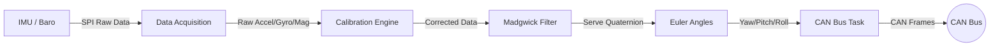

# System Architecture

This document explains the software design choices and data flow of the Industrial AHRS Navigation Module (V3.0).

## Dual-Core FreeRTOS Design

The ESP32-S3's dual-core architecture is leveraged to separate critical real-time sensor fusion from non-critical communication tasks.

| Core | Task Name | Priority | Responsibilities |
|------|-----------|----------|------------------|
| **Core 1** | `Task_Sensors` | High | - Sensor Data Acquisition (SPI) - Hard Iron Calibration - Madgwick Sensor Fusion (100Hz) - CAN Bus Broadcast |
| **Core 0** | `Task_LEDs` | Low | - RGB LED Animations (NeoPixel) - WiFi WebSockets (Optional) - Web Dashboard Hosting |

**Why this split?**
Sensor fusion requires strict timing (10ms loop). LED animations (WS2812B) disable interrupts during data transmission, which would cause jitter in our fusion algorithm. By placing them on separate cores, the navigation loop remains jitter-free.

## Calibration Routine

### Startup Sequence
1. **Power On**: System boots, Orange LED illuminates.
2. **Gyro Zeroing (10s)**: The system collects 1000 samples of gyroscope data while stationary to determine the zero-rate offset.
3. **Hard Iron Calibration**: Magnetometer data is corrected for hard-iron distortions using pre-calculated offsets stored in EEPROM/Flash.
4. **Fusion Start**: Once calibrated, the Green LED flashes, and the Madgwick filter begins integration.

## System Data Flow

