# 🏗️ System Architecture

[🔙 **Back to Main README**](../README.md)

This document explains the complete software architecture, sensor fusion mathematics, and data flow of the **Industrial AHRS Navigation Module (V5.1)**.

---

## ⚡ FreeRTOS Task Architecture

The ESP32-S3 dual-core processor runs three dedicated FreeRTOS tasks plus the Arduino `loop()` function.

### Task Configuration

| Task | Function | Priority | Core | Stack | Rate | Delay |
| :--- | :--- | :--- | :--- | :--- | :--- | :--- |
| **taskSensor** | `taskSensor()` | 3 (Highest) | Core 1 | 4096 bytes | ~200Hz | `vTaskDelay(pdMS_TO_TICKS(5))` |
| **taskCAN** | `taskCAN()` | 2 (Mid) | Core 0 | 4096 bytes | 50Hz | `vTaskDelay(pdMS_TO_TICKS(20))` |
| **taskLED** | `taskLED()` | 1 (Lowest) | Core 0 | 2048 bytes | 10Hz | `vTaskDelay(pdMS_TO_TICKS(100))` |
| **loop()** | `loop()` | 1 (Lowest) | Core 1 | Default | Idle | `vTaskDelay(50)` / `(100)` |

### Task Creation Code
```cpp
xTaskCreatePinnedToCore(taskSensor, "IMU", 4096, NULL, 3, NULL, 1);  // Core 1
xTaskCreatePinnedToCore(taskCAN,    "CAN", 4096, NULL, 2, NULL, 0);  // Core 0
xTaskCreatePinnedToCore(taskLED,    "LED", 2048, NULL, 1, NULL, 0);  // Core 0
```

> [!TIP]
> **Why is `taskSensor` pinned to Core 1?**
> The ESP32-S3 TWAI (CAN) driver generates interrupts on Core 0 by default. Pinning the time-critical DMP FIFO reads to Core 1 prevents CAN bus interrupts from causing timing jitter in the sensor fusion loop.

## 🌈 LED Behaviour (taskLED)

### Pin 1 — External Status
- **Solid Green**: Normal Operation (Sensor Fusion Active)
- **Breathing Blue**: WiFi / OTA Active (UDP Streaming)

```cpp
if (otaInitialized) {
    // Breathing Blue logic
    breathVal += breathDir;
    if (breathVal >= 200 || breathVal <= 10) breathDir = -breathDir;
    extLED.setPixelColor(0, extLED.Color(0, 0, (uint8_t)breathVal));
} else {
    // Solid Green
    extLED.setPixelColor(0, extLED.Color(0, 80, 0));
}
```

### Pin 48 — Onboard Purple Heartbeat
```cpp
uint32_t purple = obLED.Color(60, 0, 150);
blinkTimer++;
if (blinkTimer >= 15) {  // Toggle every 15 × 100ms = 1.5s
    blinkState = !blinkState;
    obLED.setPixelColor(0, blinkState ? purple : off);
    blinkTimer = 0;
}
```

### Thread Safety — Mutex

The shared orientation data (`robotYaw`, `robotPitch`, `robotRoll`) is protected by a FreeRTOS mutex:

```cpp
SemaphoreHandle_t dataMutex = xSemaphoreCreateMutex();

// Writer (taskSensor):
if (xSemaphoreTake(dataMutex, portMAX_DELAY)) {
    robotYaw   = calculated_yaw;
    robotPitch = calculated_pitch;
    robotRoll  = calculated_roll;
    // ... serial output also inside mutex ...
    xSemaphoreGive(dataMutex);
}

// Reader (taskCAN):
if (xSemaphoreTake(dataMutex, portMAX_DELAY)) {
    int16_t y = (int16_t)(robotYaw * 100);
    int16_t p = (int16_t)(robotPitch * 100);
    int16_t r = (int16_t)(robotRoll * 100);
    xSemaphoreGive(dataMutex);
    // ... pack and transmit outside mutex ...
}
```

> [!NOTE]
> Both tasks use `portMAX_DELAY` (infinite blocking). This guarantees data consistency but means each task may briefly stall waiting for the other. Since sensor runs at 200Hz and CAN at 50Hz, contention is minimal.

---

## 🧠 DMP Sensor Fusion (ICM-20948)

### DMP Configuration

The ICM-20948's on-chip Digital Motion Processor handles the accelerometer + gyroscope fusion internally, outputting a quaternion.

| Parameter | Value | API Call |
| :--- | :--- | :--- |
| Sensor Mode | Game Rotation Vector (6-axis, no mag) | `enableDMPSensor(INV_ICM20948_SENSOR_GAME_ROTATION_VECTOR, true)` |
| Output Data Rate | 225 Hz (maximum) | `setDMPODRrate(DMP_ODR_Reg_Quat6, 0)` — divisor 0 = max rate |
| SPI Clock Speed | 3 MHz | `myICM.begin(PIN_CS_ACCEL, SPI, 3000000)` |
| Data Interface | FIFO Buffer | `enableFIFO()` + `enableDMP()` |

### DMP Initialization Sequence
```
1. myICM.begin()          → SPI connection at 3 MHz
2. myICM.initializeDMP()  → Load DMP firmware to ICM-20948
3. enableDMPSensor()      → Enable GAME_ROTATION_VECTOR
4. setDMPODRrate()        → Set output rate to 225Hz
5. enableFIFO()           → Route DMP output through FIFO
6. enableDMP()            → Start the DMP
7. resetDMP()             → Clear DMP state
8. resetFIFO()            → Flush FIFO buffer
```

If `initializeDMP()` fails, the onboard LED turns **solid red** and the system halts (`while(1)`).

### Quaternion Normalization

The DMP outputs raw 30-bit fixed-point quaternion components (Q1, Q2, Q3). The scalar component Q0 is not transmitted and must be recovered from the unit quaternion constraint:

```
q1 = raw_Q1 / 2³⁰           (2³⁰ = 1,073,741,824)
q2 = raw_Q2 / 2³⁰
q3 = raw_Q3 / 2³⁰
q0 = √(1 − q1² − q2² − q3²)  ← unit quaternion: |q| = 1
```

```cpp
// From esp32s3.ino, lines 109-112:
double q1 = ((double)data.Quat6.Data.Q1) / 1073741824.0;
double q2 = ((double)data.Quat6.Data.Q2) / 1073741824.0;
double q3 = ((double)data.Quat6.Data.Q3) / 1073741824.0;
double q0 = sqrt(1.0 - ((q1 * q1) + (q2 * q2) + (q3 * q3)));
```

### Quaternion → Euler Angle Conversion

The quaternion is converted to aerospace-convention Euler angles (ZYX intrinsic rotation order):

| Angle | Formula | Range |
| :--- | :--- | :--- |
| **Roll (φ)** | `atan2(2(q0·q1 + q2·q3), 1 − 2(q1² + q2²)) × 180/π` | ±180° |
| **Pitch (θ)** | `asin(2(q0·q2 − q3·q1)) × 180/π` | ±90° |
| **Yaw (ψ)** | `atan2(2(q0·q3 + q1·q2), 1 − 2(q2² + q3²)) × 180/π` | ±180° |

```cpp
// From esp32s3.ino, lines 115-117:
robotRoll  = atan2(2.0*(q0*q1 + q2*q3), 1.0 - 2.0*(q1*q1 + q2*q2)) * 180.0/PI;
robotPitch = asin(2.0*(q0*q2 - q3*q1)) * 180.0/PI;
robotYaw   = atan2(2.0*(q0*q3 + q1*q2), 1.0 - 2.0*(q2*q2 + q3*q3)) * 180.0/PI;
```

> [!IMPORTANT]
> **Gimbal Lock Warning**: The `asin()` function in the Pitch calculation will produce unstable results when Pitch approaches ±90°. This is a known limitation of Euler angle representations. For competition robotics operating on relatively flat surfaces, this is acceptable.

---

## 🌡️ BMP388 Barometer

### Configuration

| Parameter | Setting | API Call |
| :--- | :--- | :--- |
| Interface | SPI | `bmp.begin_SPI(PIN_CS_BARO, &SPI)` |
| Temp Oversampling | 8× | `setTemperatureOversampling(BMP3_OVERSAMPLING_8X)` |
| Pressure Oversampling | 4× | `setPressureOversampling(BMP3_OVERSAMPLING_4X)` |
| IIR Filter | Coefficient 3 | `setIIRFilterCoeff(BMP3_IIR_FILTER_COEFF_3)` |
| Output Data Rate | 50 Hz | `setOutputDataRate(BMP3_ODR_50_HZ)` |

### Calculations

```
Temperature (°C) = bmp.temperature                  (direct reading)
Pressure (hPa)   = bmp.pressure / 100.0              (BMP388 outputs Pa → convert to hPa)
Altitude (m)     = bmp.readAltitude(1013.25)          (barometric formula, ISA sea-level ref)
```

The altitude calculation uses the **International Standard Atmosphere (ISA)** barometric formula internally:

```
altitude = 44330.0 × (1.0 − (P / P₀)^0.1903)

Where:
  P  = measured pressure (hPa)
  P₀ = sea-level reference pressure = 1013.25 hPa
```

---

## 🔄 System Data Flow

```mermaid
flowchart TD
    subgraph BOOT ["Setup (runs once)"]
        direction LR
        SPI_Init["SPI.begin()"] --> ICM_Init["DMP Init<br/>225Hz Quat6"]
        ICM_Init --> BMP_Init["BMP388 Init<br/>50Hz, 8x/4x OS"]
        BMP_Init --> CAN_Init["TWAI Init<br/>1 Mbps"]
        CAN_Init --> Tasks["Create 3 Tasks"]
    end

    subgraph RUNTIME ["Runtime (3 parallel tasks)"]
        subgraph Core1 ["Core 1: taskSensor (P3, 5ms loop)"]
            direction TB
            FIFO["readDMPdataFromFIFO()"]
            QNorm["Normalize Quaternion<br/>÷ 2³⁰, recover q0"]
            EulerCalc["Euler Conversion<br/>atan2, asin"]
            BaroRead["bmp.performReading()"]
            SerialOut["Serial CSV<br/>13 fields @ 115200"]
        end

        subgraph Core0_CAN ["Core 0: taskCAN (P2, 20ms loop)"]
            direction TB
            MutexRead["Mutex Read<br/>Yaw, Pitch, Roll"]
            Scale["Scale × 100<br/>→ int16_t"]
            Pack["Big-Endian Pack<br/>6 bytes"]
            Transmit["twai_transmit()<br/>ID: 0x101"]
        end

        subgraph Core0_LED ["Core 0: taskLED (P1, 20ms loop)"]
            direction TB
            Rainbow["Pin 1: ColorHSV<br/>hue += 250"]
            Blink["Pin 48: Toggle<br/>every 15 loops"]
        end
    end

    FIFO --> QNorm --> EulerCalc --> BaroRead --> SerialOut
    EulerCalc -.->|"🔒 Mutex"| MutexRead
    MutexRead --> Scale --> Pack --> Transmit

    BOOT --> RUNTIME
```



### Serial CSV Output Format (13 Fields)

The sensor task outputs one CSV line per DMP reading at 115200 baud:

```
Index:   [0]  [1]  [2]   [3]     [4]    [5]   [6]   [7]  [8]  [9]   [10]   [11]      [12]
Field:   0.0, 0.0, 0.0, Pitch,  Roll,  Yaw,  Yaw,  0.0, 0.0, 0.0, Temp, Pressure, Altitude
Unit:     —    —    —    deg     deg    deg    deg    —    —    —    °C     hPa        m
```

> [!NOTE]
> Fields [0-2] and [7-9] are reserved (sent as `0.0` for legacy compatibility). Field [6] is a duplicate of field [5] (Yaw).

---

## 🔌 CAN Bus (TWAI)

### Configuration
```cpp
twai_general_config_t g_config = TWAI_GENERAL_CONFIG_DEFAULT(
    (gpio_num_t)PIN_CAN_TX,    // GPIO 5
    (gpio_num_t)PIN_CAN_RX,    // GPIO 6
    TWAI_MODE_NORMAL
);
twai_timing_config_t t_config = TWAI_TIMING_CONFIG_1MBITS();
twai_filter_config_t f_config = TWAI_FILTER_CONFIG_ACCEPT_ALL();
```

### Data Packing
See [CAN Protocol Specification](CAN_PROTOCOL.md) for complete byte-level details.

---

## 🌈 LED Behaviour (taskLED)

### Pin 1 — External Rainbow Cycle
```cpp
extLED.setPixelColor(0, extLED.ColorHSV(rainbowHue));  // HSV color wheel
rainbowHue += 250;  // Full cycle = 65536 / 250 = ~262 loops = ~5.2 seconds
```

### Pin 48 — Onboard Purple Heartbeat
```cpp
uint32_t purple = obLED.Color(60, 0, 150);  // Neon Purple (R:60 G:0 B:150)
blinkTimer++;
if (blinkTimer >= 15) {  // Toggle every 15 × 20ms = 300ms → 0.6s period ≈ 1.67Hz
    blinkState = !blinkState;
    obLED.setPixelColor(0, blinkState ? purple : off);
    blinkTimer = 0;
}
```
