# 🏗️ System Architecture

[🔙 **Back to Main README**](../README.md)

This document explains the software design of the **Industrial AHRS Navigation Module (V5.1)**.

---

## ⚡ 3-Task FreeRTOS Design

The ESP32-S3's dual-core architecture runs three dedicated FreeRTOS tasks with priority-based scheduling.

| Core | Task Name | Priority | Rate | Responsibilities |
| :--- | :--- | :--- | :--- | :--- |
| **Core 1** | `taskSensor` | **3 (High)** | 200Hz | DMP FIFO Read <br> BMP388 Barometer Read <br> Quaternion → Euler Conversion <br> Serial CSV Output |
| **Core 0** | `taskCAN` | **2 (Mid)** | 50Hz | Mutex-protected data read <br> CAN Bus Broadcast (TWAI @ 1 Mbps) |
| **Core 0** | `taskLED` | **1 (Low)** | 50Hz | Rainbow Cycle (Pin 1) <br> Purple Heartbeat Blink (Pin 48) |

> [!TIP]
> **Why is `taskSensor` pinned to Core 1?**
> CAN bus (TWAI) interrupts run on Core 0 by default. Pinning the critical sensor task to Core 1 prevents CAN interrupts from affecting DMP FIFO timing.

### Thread Safety

Floating-point Yaw/Pitch/Roll data is shared between `taskSensor` (writer) and `taskCAN` (reader) using `xSemaphoreCreateMutex()` with `portMAX_DELAY` blocking.

---

## 🧠 DMP Sensor Fusion

The module offloads 6-axis sensor fusion to the **ICM-20948 Digital Motion Processor**:

*   **Sensor**: `INV_ICM20948_SENSOR_GAME_ROTATION_VECTOR` (Accel + Gyro, no Magnetometer)
*   **ODR**: 225Hz (divisor = 0, maximum DMP output rate)
*   **Output**: Quaternion (Q0, Q1, Q2, Q3) → converted to Euler angles in software

### Startup Calibration
1.  DMP initializes and resets FIFO
2.  Gyro drift is zeroed during the first few seconds of operation
3.  Stable 0.0° heading established before tasks begin

---

## 🔄 System Data Flow

```mermaid
flowchart LR
    subgraph Hardware
        IMU["ICM-20948<br/>(DMP)"]
        BARO["BMP388<br/>(Baro)"]
        Bus((CAN Bus))
        LED1((Pin 1<br/>Rainbow))
        LED48((Pin 48<br/>Heartbeat))
    end

    subgraph Core1 ["Core 1: taskSensor (P3)"]
        direction TB
        FIFO[Read DMP FIFO]
        Quat[Quaternion Data]
        Euler[Euler Conversion<br/>Yaw / Pitch / Roll]
        BMP[Read BMP388]
        CSV[Serial CSV Output]
    end

    subgraph Core0 ["Core 0"]
        direction TB
        CAN_Task["taskCAN (P2)<br/>50Hz Transmit"]
        LED_Task["taskLED (P1)<br/>Rainbow + Blink"]
    end

    Mutex{{"🔒 Mutex"}}

    %% Data Flow
    IMU -->|SPI| FIFO
    FIFO --> Quat --> Euler
    BARO -->|SPI| BMP
    Euler & BMP --> CSV
    Euler --> Mutex
    Mutex --> CAN_Task
    CAN_Task -->|TWAI 1Mbps| Bus
    LED_Task --> LED1
    LED_Task --> LED48
```



### Serial CSV Format (13 fields)
```text
0.0,0.0,0.0,Pitch,Roll,Yaw,Yaw,0.0,0.0,0.0,Temp,Pressure,Altitude
```
