# 📡 CAN Bus Protocol Specification

[🔙 **Back to Main README**](../README.md)

This document defines the complete CAN bus communication protocol for the **Industrial AHRS Navigation Module (V5.1)**, including byte-level packing, decoding mathematics, and implementation examples.

---

## 📋 Protocol Summary

| Parameter | Value |
| :--- | :--- |
| **Driver** | ESP32-S3 TWAI (Two-Wire Automotive Interface) |
| **Baud Rate** | 1 Mbps (`TWAI_TIMING_CONFIG_1MBITS()`) |
| **Mode** | Normal (`TWAI_MODE_NORMAL`) |
| **Filter** | Accept All (`TWAI_FILTER_CONFIG_ACCEPT_ALL()`) |
| **ID Format** | Standard 11-bit |
| **Byte Order** | Big Endian (MSB first) |
| **Transmit Rate** | 50 Hz (every 20ms) |
| **Transmit Timeout** | 10ms (`pdMS_TO_TICKS(10)`) |
| **Target Devices** | Robomaster C620/C610 speed controllers |

---

## 🆔 Message Definition

The module transmits a **single CAN frame** per cycle:

| CAN ID | Description | DLC | Byte 0 | Byte 1 | Byte 2 | Byte 3 | Byte 4 | Byte 5 |
| :--- | :--- | :--- | :--- | :--- | :--- | :--- | :--- | :--- |
| **0x101** | Orientation | **6** | Yaw Hi | Yaw Lo | Pitch Hi | Pitch Lo | Roll Hi | Roll Lo |

> [!NOTE]
> `data_length_code = 6`. Only 6 of the 8 available CAN data bytes are used. Bytes 6 and 7 are not transmitted.

---

## 🧮 Data Packing (Firmware Side)

### Step 1: Float → Fixed-Point Scaling

Each Euler angle (in degrees) is multiplied by 100 and cast to a signed 16-bit integer:

```cpp
int16_t y = (int16_t)(robotYaw   * 100);  // e.g., 145.30° → 14530
int16_t p = (int16_t)(robotPitch * 100);  // e.g.,   2.45° →   245
int16_t r = (int16_t)(robotRoll  * 100);  // e.g.,  -1.10° →  -110
```

| Property | Value |
| :--- | :--- |
| Data type | `int16_t` (signed 16-bit) |
| Range | -32,768 to +32,767 |
| Resolution | 0.01° per LSB |
| Max representable | ±327.67° |

### Step 2: Big-Endian Byte Packing

Each `int16_t` is split into two bytes, **MSB first**:

```cpp
// Yaw → bytes [0..1]
message.data[0] = (y >> 8) & 0xFF;   // High byte (MSB)
message.data[1] = y & 0xFF;          // Low byte (LSB)

// Pitch → bytes [2..3]
message.data[2] = (p >> 8) & 0xFF;
message.data[3] = p & 0xFF;

// Roll → bytes [4..5]
message.data[4] = (r >> 8) & 0xFF;
message.data[5] = r & 0xFF;
```

### Packing Example

For orientation `Yaw=145.30°, Pitch=2.45°, Roll=-1.10°`:

```
Yaw   → 14530   → 0x38C2 → data[0]=0x38, data[1]=0xC2
Pitch →   245   → 0x00F5 → data[2]=0x00, data[3]=0xF5
Roll  →  -110   → 0xFF92 → data[4]=0xFF, data[5]=0x92
                              (two's complement for negative)

CAN Frame: [0x38, 0xC2, 0x00, 0xF5, 0xFF, 0x92]
```

---

## 🔓 Data Decoding (Receiver Side)

### Step 1: Reconstruct `int16_t` from Big-Endian Bytes

```cpp
// C/C++ Receiver Example:
int16_t yaw_raw   = (int16_t)((data[0] << 8) | data[1]);
int16_t pitch_raw = (int16_t)((data[2] << 8) | data[3]);
int16_t roll_raw  = (int16_t)((data[4] << 8) | data[5]);
```

### Step 2: Convert to Degrees

```cpp
float yaw_deg   = yaw_raw   / 100.0f;   // 14530 → 145.30°
float pitch_deg = pitch_raw / 100.0f;    //   245 →   2.45°
float roll_deg  = roll_raw  / 100.0f;    //  -110 →  -1.10°
```

### Python Example
```python
import struct

def decode_orientation(data):
    """Decode 6-byte CAN payload to Euler angles."""
    yaw_raw   = struct.unpack('>h', bytes(data[0:2]))[0]  # '>h' = big-endian int16
    pitch_raw = struct.unpack('>h', bytes(data[2:4]))[0]
    roll_raw  = struct.unpack('>h', bytes(data[4:6]))[0]
    return {
        'yaw':   yaw_raw   / 100.0,
        'pitch': pitch_raw / 100.0,
        'roll':  roll_raw  / 100.0,
    }

# Example:
payload = [0x38, 0xC2, 0x00, 0xF5, 0xFF, 0x92]
result = decode_orientation(payload)
# → {'yaw': 145.30, 'pitch': 2.45, 'roll': -1.10}
```

---

## 💻 Decoded Data Example (JSON)

```json
{
  "can_id": "0x101",
  "dlc": 6,
  "raw_hex": "38 C2 00 F5 FF 92",
  "decoded": {
    "yaw_deg": 145.30,
    "pitch_deg": 2.45,
    "roll_deg": -1.10
  }
}
```

---

## ⏱️ Timing & Thread Safety

| Parameter | Value |
| :--- | :--- |
| **Source Task** | `taskCAN` (Priority 2, Core 0) |
| **Transmit Interval** | 20ms (50 Hz) |
| **Transmit Timeout** | 10ms — frame is dropped if bus is busy longer |
| **Data Source** | Mutex-protected read from `taskSensor` shared variables |
| **Mutex Policy** | `portMAX_DELAY` — blocks until data is available |

```mermaid
sequenceDiagram
    participant Sensor as taskSensor (Core 1)
    participant Mutex as 🔒 Mutex
    participant CAN as taskCAN (Core 0)
    participant Bus as CAN Bus

    loop Every 5ms
        Sensor->>Mutex: Take (write Yaw/Pitch/Roll)
        Sensor->>Mutex: Give
    end

    loop Every 20ms
        CAN->>Mutex: Take (read Yaw/Pitch/Roll)
        Mutex-->>CAN: float values
        CAN->>CAN: Scale ×100, cast int16_t
        CAN->>Mutex: Give
        CAN->>CAN: Big-endian pack (6 bytes)
        CAN->>Bus: twai_transmit(0x101)
    end
```



---

## 🔌 Hardware Configuration

| Pin | Function | Direction |
| :--- | :--- | :--- |
| **GPIO 5** | CAN TX | Output |
| **GPIO 6** | CAN RX | Input |

Transceiver: **SN65HVD230** (3.3V compatible, no level shifter needed).

> [!WARNING]
> The CAN bus requires proper **120Ω termination resistors** at each end of the bus. Without termination, signal reflections will cause communication errors at 1 Mbps.
