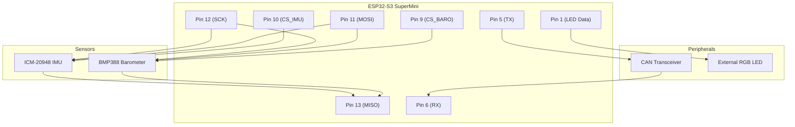

# Hardware Wiring & Pinout

This document details the hardware connections for the Industrial AHRS Navigation Module (V3.0).

## Pinout Configuration

| ESP32-S3 Pin | Function | Description |
|--------------|----------|-------------|
| 12 | SCK | SPI Clock |
| 13 | MISO | SPI Master In Slave Out |
| 11 | MOSI | SPI Master Out Slave In |
| 10 | CS_IMU | Chip Select (ICM-20948) |
| 9 | CS_BARO | Chip Select (BMP388) |
| 5 | CAN_TX | CAN Bus Transmit |
| 6 | CAN_RX | CAN Bus Receive |
| 48 | LED_Builtin | Onboard RGB LED |
| 1 | LED_Ext | External RGB LED Data Line |

## Connection Diagram

> [!WARNING]
> **Power Voltage Warning**
> The ESP32-S3 operates at **3.3V logic levels**. Do not connect 5V signals directly to any GPIO pins, as this may damage the MCU. Ensure your CAN transceiver and sensors are compatible or use level shifters.
