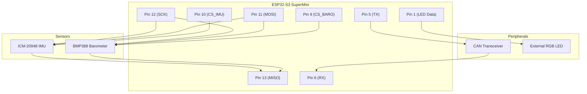

# 📟 Hardware Wiring & Pinout

[🔙 **Back to Main README**](../README.md)

This document details the hardware connections for the **Industrial AHRS Navigation Module (V3.0)**.

---

## 📌 Pinout Configuration

The module uses the **ESP32-S3 SuperMini**. Below is the complete pin mapping.

| ESP32-S3 Pin | Function | Description | Type |
| :--- | :--- | :--- | :--- |
| **12** | `SCK` | SPI Clock | Output |
| **13** | `MISO` | SPI Master In Slave Out | Input |
| **11** | `MOSI` | SPI Master Out Slave In | Output |
| **10** | `CS_IMU` | Chip Select (ICM-20948) | Output |
| **9** | `CS_BARO` | Chip Select (BMP388) | Output |
| **5** | `CAN_TX` | CAN Bus Transmit | Output |
| **6** | `CAN_RX` | CAN Bus Receive | Input |
| **48** | `LED_Builtin` | Onboard RGB LED | Output |
| **1** | `LED_Ext` | External RGB LED Data Line | Output |

---

## 🔌 Connection Diagram

The following diagram illustrates the signal flow between the components.

---

> [!WARNING]
> **⚡ Power Voltage Warning**
>
> The ESP32-S3 operates at **3.3V logic levels**.
> *   **Do not connect 5V signals** directly to any GPIO pins, as this may damage the MCU.
> *   Ensure your CAN transceiver and sensors are **3.3V compatible** or use appropriate logic level shifters.
