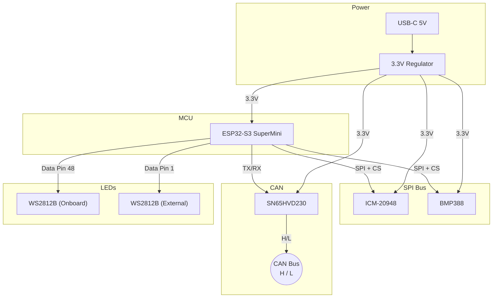

# 🔩 PCB Design (V1)

[🔙 **Back to Main README**](../README.md)

This document describes the custom PCB design for the **Industrial AHRS Navigation Module**.

> [!NOTE]
> The raw design files are located in the `v1/` directory and can be opened with **KiCad 8+**.

---

## 📐 Board Overview

| Parameter | Value |
| :--- | :--- |
| **PCB Layers** | 2-Layer |
| **Logic Level** | 3.3V |
| **MCU** | ESP32-S3 SuperMini (Module) |
| **Design Tool** | KiCad 8 |

---

## 🧩 Component List (BOM)

| Ref | Component | Package | Function |
| :--- | :--- | :--- | :--- |
| U1 | **ESP32-S3 SuperMini** | Module | Main Controller |
| U2 | **ICM-20948** | LGA-24 | 9-DOF IMU (Accel/Gyro/Mag) |
| U3 | **BMP388** | LGA-10 | Precision Barometer |
| U4 | **SN65HVD230** | SOIC-8 | CAN Bus Transceiver |
| D1 | **WS2812B** | 5050 | Onboard RGB LED |
| D2 | **WS2812B** | 5050 | External RGB LED |
| J1 | **USB-C** | - | Programming & Power |
| J2 | **CAN Header** | 2-Pin | CAN H / CAN L |

---

## 🔌 Circuit Block Diagram

---

## 📁 Design Files

| File | Description |
| :--- | :--- |
| `v1/v1.kicad_sch` | Schematic |
| `v1/v1.kicad_pcb` | PCB Layout |
| `v1/v1.kicad_pro` | Project File |

> [!TIP]
> To view these files, install [KiCad](https://www.kicad.org/) (free, open-source) and open `v1/v1.kicad_pro`.
