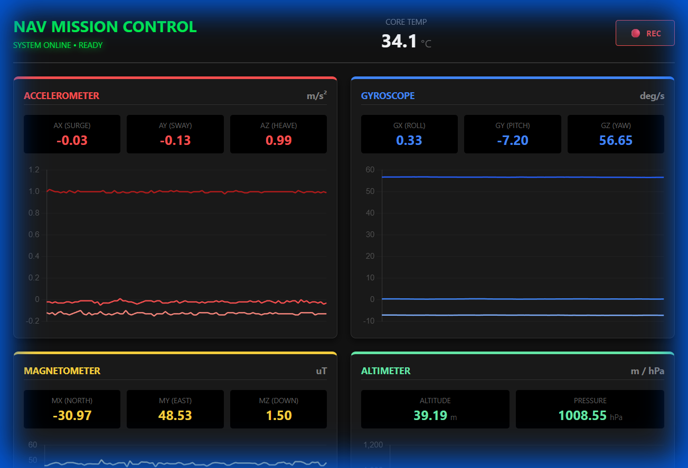
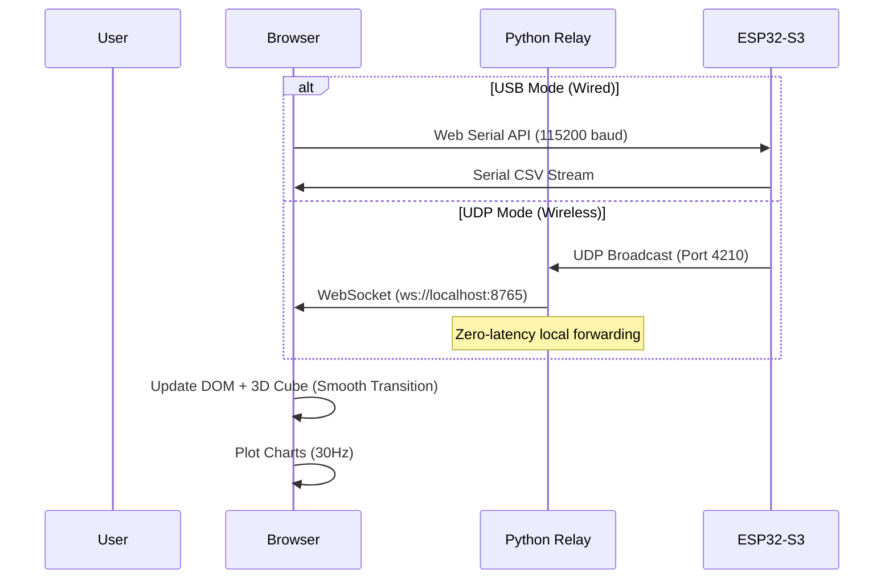

# 🖥️ Web Dashboard — NAV PANEL v5.4

[🔙 **Back to Main README**](../README.md)

The **NAV PANEL** is a browser-based ground control station for real-time telemetry monitoring and 3D orientation visualization. It supports **Dual-Mode Connectivity**:
1.  **USB Serial**: Direct connection via Web Serial API (Chrome/Edge only).
2.  **Wireless UDP**: Low-latency streaming over WiFi via a local Python relay.

Features a **Cyberpunk Neon Purple & Cyan** theme, now with **smoothed animations** (3D cube, compass) and **30Hz charts**.



---

## ⚡ Quick Start

### Option A: USB Serial (Wired)
1.  Connect ESP32-S3 via USB.
2.  Click **🔌 USB**.
3.  Select COM port.

### Option B: Wireless UDP (WiFi)
1.  Connect laptop to `NAV_MODULE_OTA` WiFi.
2.  Run the relay script: `python firmware/udp_relay.py`.
3.  Click **📡 WIFI** (connects to `ws://localhost:8765`).

---

## 🎨 Design System

### CSS Variables (Color Palette)
```css
:root {
    --primary-purple: #bd00ff;    /* Panel headers, borders, glow effects */
    --accent-cyan:    #00f3ff;    /* Data values, connect button, online status */
    --alert-pink:     #ff0055;    /* Tare button, roll graph, altitude accent */
    --bg-dark:        #05000a;    /* Background (near-black with purple tint) */
    --panel-bg:       rgba(18, 2, 28, 0.9);  /* Semi-transparent panel fill */
    --text-dim:       #9e8fb2;    /* Labels, secondary text */
}
```

### Layout
- **Grid**: `grid-template-columns: 300px 1fr 300px` / `grid-template-rows: 60% 40%`
- **Viewport**: `100vw × 100vh` with `overflow: hidden` (no scrolling)
- **Background**: 40×40px purple grid lines for cyberpunk aesthetic
- **Typography**: Segoe UI / Verdana (system), Consolas (monospace values)

---

## 📊 Panel Reference

### Panel 1 — Primary Navigation (Left Column)

| Element | ID | Data Source | Format |
| :--- | :--- | :--- | :--- |
| **HEADING** | `#v_y` | CSV field [5] (Yaw) | `y.toFixed(2)` → `"145.30"` |
| **RELATIVE** | `#v_yr` | Yaw − Tare offset | `(y - tareVal).toFixed(2)` |
| **PITCH** | `#v_p` | CSV field [3] (Pitch) | `p.toFixed(1)` → `"2.5"` |
| **ROLL** | `#v_r` | CSV field [4] (Roll) | `r.toFixed(1)` → `"-1.1"` |
| **TARE ZERO POINT** | `#btnTare` | Captures current Yaw | `tareVal = parseFloat(v_y.innerText)` |

#### Tare Calculation
```javascript
// On button press: capture current Yaw as the zero reference
document.getElementById('btnTare').onclick = () => {
    tareVal = parseFloat(document.getElementById('v_y').innerText);
};

// On each update: subtract tare from raw yaw
relative_heading = yaw - tareVal;
```

This allows the driver to **instantly reset the front-facing heading to 0°** from any arbitrary position.

### Panel 2 — Spatial Awareness (Center)

A **CSS 3D cube** (180×180px) mirrors the robot's physical orientation in real-time.

#### 3D Transform Mapping
```javascript
// From index.html, line 449:
cube.style.transform = `rotateX(${-p}deg) rotateY(${y}deg) rotateZ(${-r}deg)`;
```

| CSS Transform | Sensor Axis | Sign | Reason |
| :--- | :--- | :--- | :--- |
| `rotateX()` | Pitch | **Inverted** (`-p`) | CSS rotateX positive = tilt forward, sensor positive = nose up |
| `rotateY()` | Yaw | Normal (`y`) | Both conventions agree on clockwise = positive |
| `rotateZ()` | Roll | **Inverted** (`-r`) | CSS rotateZ positive = counter-clockwise, sensor positive = right wing down |

#### CSS 3D Configuration
```css
#sim-container { perspective: 900px; }
#cube {
    width: 180px; height: 180px;
    transform-style: preserve-3d;
    transition: transform 80ms ease-out;  /* Smooths rotation between 50Hz updates */
    will-change: transform;               /* GPU acceleration hint */
}
.face { backface-visibility: visible; }
.front { transform: translateZ(90px); }     /* Cyan highlight */
.back  { transform: rotateY(180deg) translateZ(90px); }
.right { transform: rotateY(90deg) translateZ(90px); }
.left  { transform: rotateY(-90deg) translateZ(90px); }
.top   { transform: rotateX(90deg) translateZ(90px); }
.bottom{ transform: rotateX(-90deg) translateZ(90px); }
```

### Panel 3 — Environment (Right Column)

| Element | ID | Data Source | Format | Unit |
| :--- | :--- | :--- | :--- | :--- |
| **ALTITUDE** | `#v_alt` | CSV field [12] | `alt.toFixed(1)` | m |
| **TEMP** | `#v_temp` | CSV field [10] | `temp.toFixed(1)` | °C |
| **PRESSURE** | `#v_press` | CSV field [11] | `d[11].toFixed(0)` | hPa |

### Panel 3 (cont.) — System Health

| Indicator | Static Value | Color |
| :--- | :--- | :--- |
| **CPU LOAD** | `NOMINAL` | Cyan (`--accent-cyan`) |
| **CAN BUS** | `ACTIVE (1 MBPS)` | Purple (`--primary-purple`) |

### Panel 4 — Stability Graphs (Bottom Row, spans 3 columns)

Three separate **Chart.js** line graphs track orientation stability:

| Graph | Canvas ID | Color | Data Source | Line |
| :--- | :--- | :--- | :--- | :--- |
| **YAW STABILITY** | `#chartYaw` | `#00f3ff` (Cyan) | `yaw - tareVal` | 2px, tension 0.3 |
| **PITCH** | `#chartPitch` | `#bd00ff` (Purple) | Pitch (raw) | 2px, tension 0.3 |
| **ROLL** | `#chartRoll` | `#ff0055` (Pink) | Roll (raw) | 2px, tension 0.3 |

#### Chart Configuration
```javascript
const commonOptions = {
    responsive: true,
    maintainAspectRatio: false,
    plugins: { legend: { display: false } },
    scales: {
        x: { display: false },              // No X-axis labels
        y: { grid: { color: 'rgba(255,255,255,0.05)' },
             ticks: { color: '#666', font: { size: 9 } } }
    },
    animation: false,                        // Disabled for performance
    elements: { point: { radius: 0 } }       // No data points (line only)
};
```

- **Window size**: 40 samples (rolling buffer)
- **Update method**: `push()` + `shift()` — FIFO

```javascript
function updateGraph(chart, val) {
    chart.data.datasets[0].data.push(val);   // Add new value
    chart.data.datasets[0].data.shift();     // Remove oldest
    chart.update();
}
```

---

## 🔌 Dual-Mode Connection (USB / UDP)

### Connection Flow



### Serial Data Parsing

```javascript
// From index.html, lines 433-455:
function update(line) {
    const d = line.split(',').map(Number);  // Parse CSV → number array
    if (d.length < 13) return;               // Reject incomplete lines

    // Extract fields by index:
    const p = d[3];      // Pitch (degrees)
    const r = d[4];      // Roll (degrees)
    const y = d[5];      // Yaw (degrees)
    const temp = d[10];  // Temperature (°C)
    const alt = d[12];   // Altitude (m)
    // d[11] = Pressure (hPa) — used inline

    // Update readouts
    v_y.innerText    = y.toFixed(2);              // Heading
    v_yr.innerText   = (y - tareVal).toFixed(2);  // Relative (tared)
    v_p.innerText    = p.toFixed(1);              // Pitch
    v_r.innerText    = r.toFixed(1);              // Roll
    v_temp.innerText = temp.toFixed(1);           // Temperature
    v_press.innerText= d[11].toFixed(0);          // Pressure
    v_alt.innerText  = alt.toFixed(1);            // Altitude

    // Update 3D Cube (pitch & roll inverted for CSS convention)
    cube.style.transform = `rotateX(${-p}deg) rotateY(${y}deg) rotateZ(${-r}deg)`;

    // Update Graphs
    updateGraph(chartYaw, y - tareVal);
    updateGraph(chartPitch, p);
    updateGraph(chartRoll, r);
}
```

### Line Buffering Logic
```javascript
async function readLoop() {
    let buffer = "";
    while (true) {
        const { value, done } = await reader.read();
        if (done) break;
        buffer += value;                      // Accumulate partial reads
        let lines = buffer.split('\n');       // Split by newline
        buffer = lines.pop();                 // Keep incomplete last line
        for (let line of lines)
            if (line.includes(',')) update(line);  // Process complete lines
    }
}
```

> [!TIP]
> The buffer pattern handles the case where a serial read returns a partial CSV line. Data is accumulated until a complete line (ending with `\n`) is available.

---

## 🔧 Serial Configuration

| Parameter | Value |
| :--- | :--- |
| **Baud Rate** | `115200` |
| **Data Format** | CSV (13 comma-separated values per line) |
| **Encoding** | UTF-8 (via `TextDecoderStream`) |

### Expected Input Format (from firmware)
```
Index:  [0]  [1]  [2]   [3]     [4]    [5]   [6]   [7]  [8]  [9]   [10]   [11]      [12]
Field:  0.0, 0.0, 0.0, Pitch,  Roll,  Yaw,  Yaw,  0.0, 0.0, 0.0, Temp, Pressure, Altitude
Unit:    —    —    —    deg     deg    deg    deg    —    —    —    °C     hPa        m
```

Fields [0-2] and [7-9] are reserved (sent as `0.0`). Field [6] duplicates field [5].

> [!TIP]
> **Offline Ready**: The `chart.js` library is bundled locally in the `firmware/` folder. This dashboard works **100% offline** — no internet connection required at competition venues.
